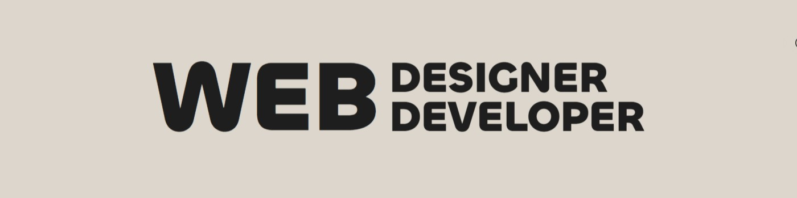

<h1 align="center">Hi, I'm Cloue Macadangdang</h1>

  

  

### About Me

I am a BCIT graduate with a dual background in **Computer Information Technology** and **Front-End Web Development**. This unique combination allows me to build web solutions that are as robust and optimized "under the hood" as they are beautiful and intuitive on the screen.

- **Backend Core:** 2 years of hands-on experience with Linux servers, enterprise networking, databases, and Python.
- **Frontend Focus:** Specialized in React, JavaScript, Advanced CSS, and modern platforms like WordPress and Shopify.
- **Design Driven:** I bridge the gap between design and code, using Figma to craft clean UIs and bringing them to life with high-performance code.

---

### My Tech Stack

#### Design & Creative

  
  
  
  
  
  
  

#### Core Development

  
  
  
  
  
  
  
  
  
  
  

#### Tools & DevOps

  
  
  
  
  
  
  
  
  
  
  
  

---

### Currently Learning
- **Tailwind CSS** for rapid UI development.
- **React** patterns and State Management.

### Connect with me:
- **Email:** [hello@kurowii.com](mailto:hello@kurowii.com)
- **LinkedIn:** [Cloue Macadangdang](https://www.linkedin.com/in/cloue-macadangdang/)
- **Website:** [kurowii.com](https://kurowii.com/)

 

### GitHub Stats

  
  

